# Algorithm Interview Patterns

一个面向面试与刷题训练的算法模式仓库。  
目标不是只记住题目答案，而是建立 **“看到题目 -> 识别结构 -> 选择方法 -> 写出稳定模板”** 的思维链路。

---

## 目录

- [项目目标](#项目目标)
- [项目结构](#项目结构)
- [如何使用这个仓库](#如何使用这个仓库)
- [算法模式总览](#算法模式总览)
- [1. 滑动窗口](#1-滑动窗口)
- [2. 双指针](#2-双指针)
- [3. BFS](#3-bfs)
- [4. DFS / 回溯](#4-dfs--回溯)
- [5. 动态规划](#5-动态规划)
- [6. 贪心](#6-贪心)
- [7. 二分搜索](#7-二分搜索)
- [8. 栈 / 单调栈](#8-栈--单调栈)
- [9. 前缀和](#9-前缀和)
- [10. 并查集](#10-并查集)
- [11. 拓扑排序](#11-拓扑排序)
- [一棵决策树：拿到题怎么选方法](#一棵决策树拿到题怎么选方法)
- [推荐训练顺序](#推荐训练顺序)
- [阶段化训练建议](#阶段化训练建议)
- [常见误区](#常见误区)
- [更多学习材料](#更多学习材料)
- [结语](#结语)

---

## 项目目标

这个仓库主要解决三个问题：

1. **把零散题目整理成稳定的算法模式**
2. **把“会做这道题”升级为“会识别这一类题”**
3. **把刷题从记忆题解，转成建立心理表征和解题决策能力**

换句话说，这个仓库不只是题库，更是一张算法模式地图。

---

## 项目结构

项目当前按算法模式划分，位于 `src/main/java` 下：

```text
src/main/java
├─ no1_slidingwindow         滑动窗口
├─ no2_twopointertechnique   双指针
├─ no3_bfs                   广度优先搜索
├─ no4_dfsbacktracking       深度优先搜索 / 回溯
├─ no5_dynamicprogramming    动态规划
├─ no6_greedy                贪心
├─ no7_binarysearch          二分搜索
├─ no8_stack                 栈 / 单调栈
├─ no9_prefixsum             前缀和
├─ no10_unionfind            并查集
└─ no11_topologicalsort      拓扑排序
```

大多数专题下又继续按训练阶段拆分：

```text
practice
├─ stage1   基础理解
├─ stage2   模式熟悉
├─ stage3   综合应用
└─ stage4   进阶变形
```

部分目录还包含专项训练，例如滑动窗口中的 `od` 目录。

---

## 如何使用这个仓库

建议按下面方式使用：

1. **先学模式，再刷题**
   - 先理解这个模式在维护什么结构
   - 再理解它如何比暴力更高效

2. **先学识别信号，再记模板**
   - 模板只是形式
   - 识别能力才是迁移能力

3. **每个专题都做三件事**
   - 说清楚基本思路
   - 写出基本步骤
   - 总结识别信号

4. **做完题后复盘三个问题**
   - 这题本质维护的是什么结构？
   - 为什么暴力方法慢？
   - 为什么当前方法能消掉这个瓶颈？

---

## 算法模式总览

从更高一层看，这 11 类模式本质上是在维护不同的“结构”：

- **滑动窗口**：维护一个可伸缩的连续区间
- **双指针**：维护两个协同移动的位置
- **BFS**：维护按层扩散的搜索前沿
- **DFS / 回溯**：维护一棵选择树
- **动态规划**：维护一张状态转移表
- **贪心**：维护一个不会后悔的局部选择规则
- **二分搜索**：维护一个单调的答案空间
- **栈 / 单调栈**：维护一个有顺序的候选集合
- **前缀和**：维护一个历史累计量
- **并查集**：维护一组动态合并的连通块
- **拓扑排序**：维护一个依赖逐步解锁的 DAG 顺序

真正要训练的，不是“关键词匹配模板”，而是：

> 这道题到底在逼我维护什么结构？

---

## 1. 滑动窗口

**目录位置：** `src/main/java/no1_slidingwindow`

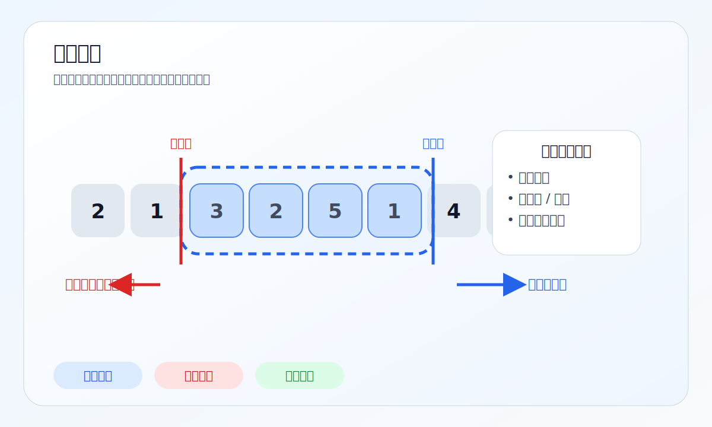

### 基本思路

滑动窗口适合处理**连续子数组 / 子串**问题。  
核心不是暴力枚举所有区间，而是维护一个会移动、会伸缩的窗口。

### 心理表征

把它想象成一个“可伸缩的盒子”：

- 右边界负责把新元素装进来
- 左边界负责在不合法时把旧元素移出去
- 窗口里始终维护着某种状态

### 基本步骤

1. 定义窗口含义
2. 定义窗口内要维护的量
3. 右指针扩张
4. 不满足条件时左指针收缩
5. 在合适时机更新答案

### 识别信号

- 连续子数组 / 子串
- 最长、最短、包含、覆盖、去重
- 条件可以随着边界移动而动态维护

---

## 2. 双指针

**目录位置：** `src/main/java/no2_twopointertechnique`

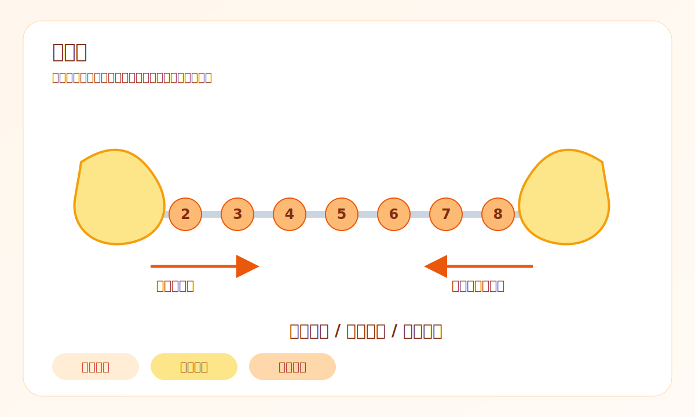

### 基本思路

双指针通过两个位置的协同移动，避免暴力枚举。

### 心理表征

不是“两个变量”，而是“两只手同时操作序列”。

常见角色：

- 左右夹逼
- 快慢指针
- 同向扫描

### 基本步骤

1. 明确两个指针各自职责
2. 根据比较结果移动对应指针
3. 利用单调性或相对位置关系减少搜索空间

### 识别信号

- 有序数组
- 两数之和 / 三数之和
- 原地去重 / 原地删除
- 链表中点、环检测、倒数第 k 个

---

## 3. BFS

**目录位置：** `src/main/java/no3_bfs`

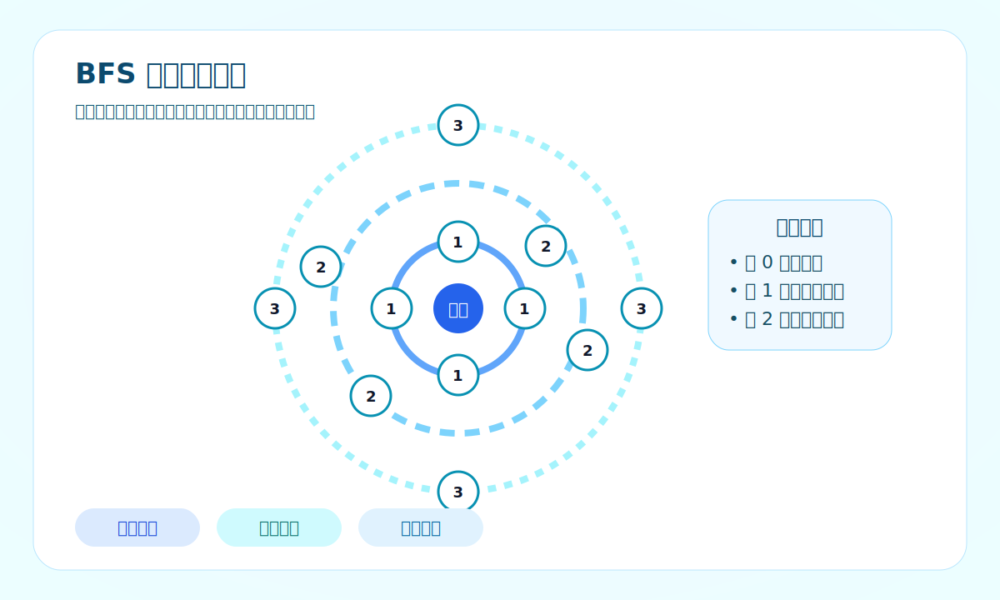

### 基本思路

BFS 按层扩散，天然适合无权图最短路和最少步数问题。

### 心理表征

像水波一样一层层往外扩散。  
“先到的一定更近”。

### 基本步骤

1. 明确节点与边
2. 起点入队
3. 标记访问
4. 分层遍历邻居
5. 到目标时返回步数

### 识别信号

- 最少步数
- 最少转换次数
- 矩阵最短路径
- 多源扩散

---

## 4. DFS / 回溯

**目录位置：** `src/main/java/no4_dfsbacktracking`

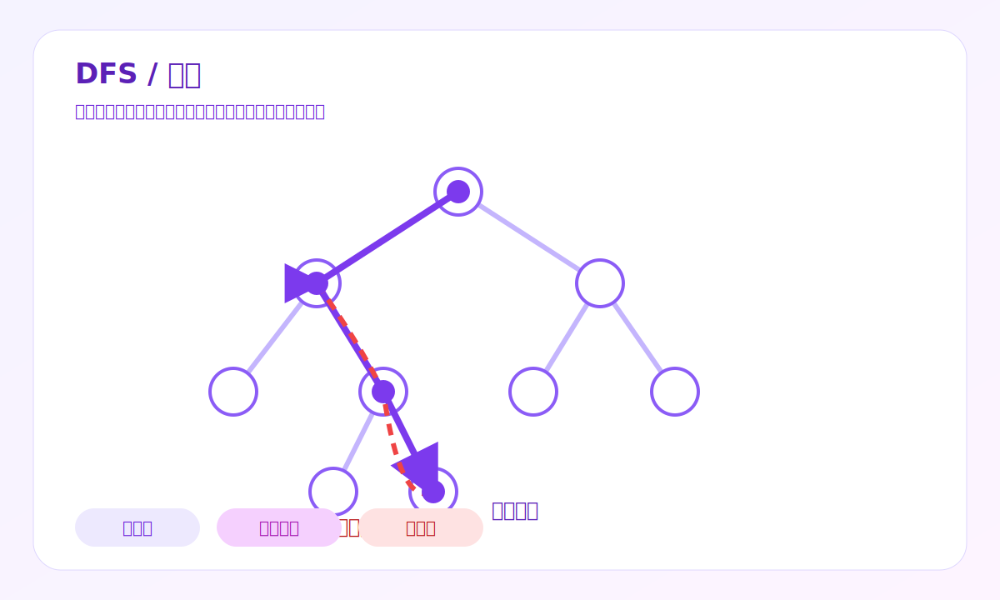

### 基本思路

DFS 是深度搜索，回溯是带“做选择 / 撤销选择”的 DFS。

### 心理表征

把问题看成一棵决策树：

- 每一层做一个选择
- 走到底看结果
- 再退回来换分支

### 基本步骤

1. 定义当前状态
2. 定义终止条件
3. 枚举当前层可选项
4. 做选择
5. 递归深入
6. 撤销选择

### 识别信号

- 所有方案
- 所有路径
- 是否存在一种可行方案
- 组合、排列、子集、切割

---

## 5. 动态规划

**目录位置：** `src/main/java/no5_dynamicprogramming`

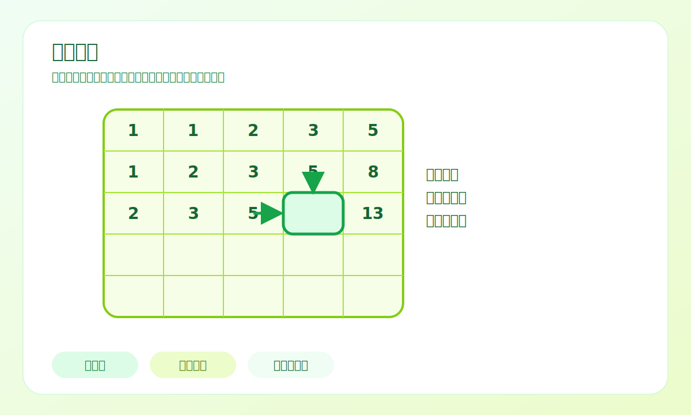

### 基本思路

动态规划的核心是：  
把原问题拆成一组重复出现的子问题，并记录子问题答案。

### 心理表征

它像一张“状态账本”：

- 每个格子存的是一个子问题答案
- 当前答案由之前格子推导出来

### 基本步骤

1. 定义状态
2. 定义状态转移
3. 定义初始值
4. 确定遍历顺序
5. 看能否做空间压缩

### 识别信号

- 最优值
- 可行性
- 方案数
- 暴力递归有大量重复

---

## 6. 贪心

**目录位置：** `src/main/java/no6_greedy`

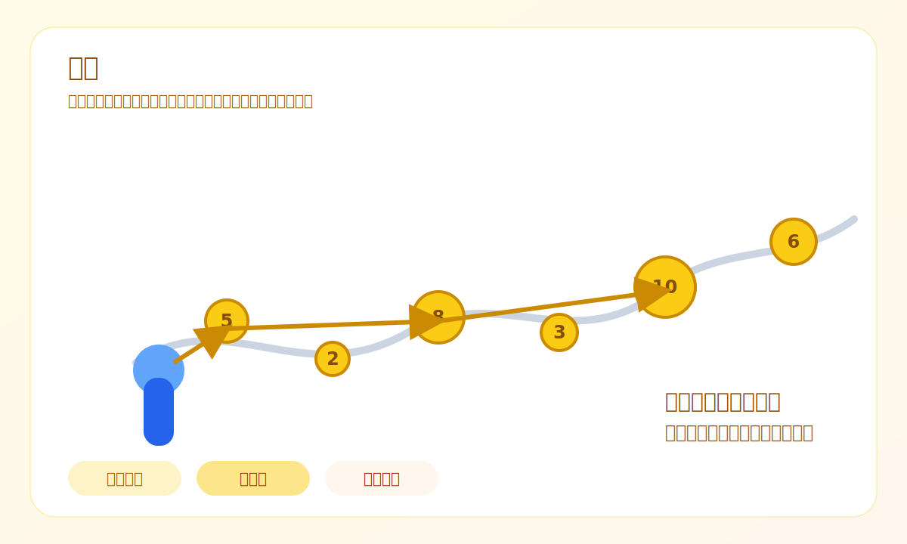

### 基本思路

每一步都做当前最优的局部选择，并希望导向全局最优。

### 心理表征

你在不断做“现在最值”的选择，关键在于证明：

> 这个局部选择不会让未来更差。

### 基本步骤

1. 找局部最优规则
2. 证明为什么这样选不吃亏
3. 用排序、扫描或优先级实现

### 识别信号

- 可排序后处理
- 每一步选择相对独立
- 一旦做了当前选择，通常不需要回头

---

## 7. 二分搜索

**目录位置：** `src/main/java/no7_binarysearch`

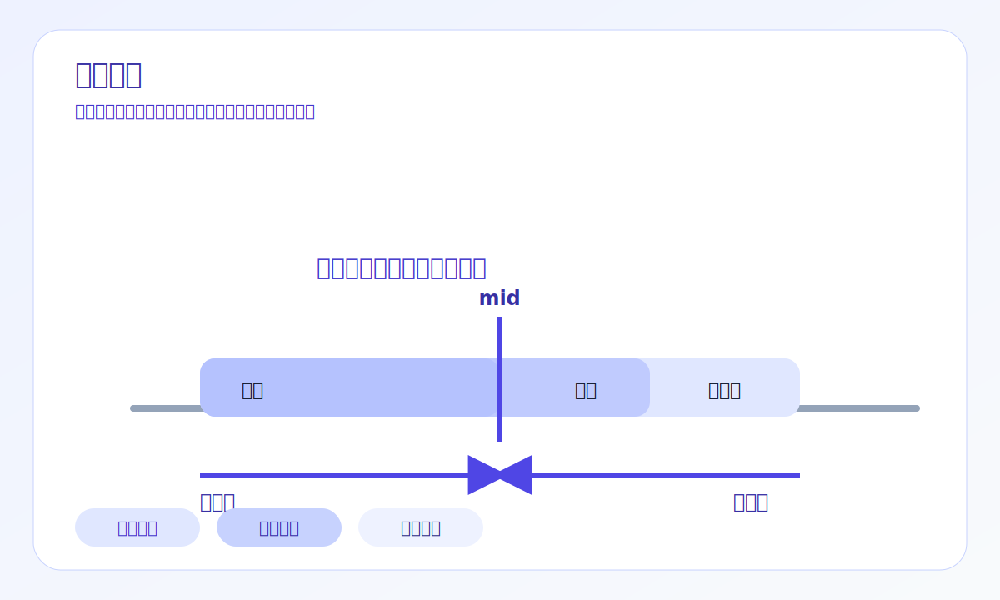

### 基本思路

二分的本质不是“在数组里找数”，而是：

> 在一个单调空间里找边界。

### 心理表征

把问题改造成“这个答案可不可行”的判定题，  
然后利用单调性不断缩小范围。

### 基本步骤

1. 确定答案区间
2. 写判定函数 `check(mid)`
3. 利用单调性缩小区间
4. 收敛到左边界或右边界

### 识别信号

- 最小的 x 使得……
- 最大的 x 仍然满足……
- 数组有序
- 答案空间存在单调性

---

## 8. 栈 / 单调栈

**目录位置：** `src/main/java/no8_stack`

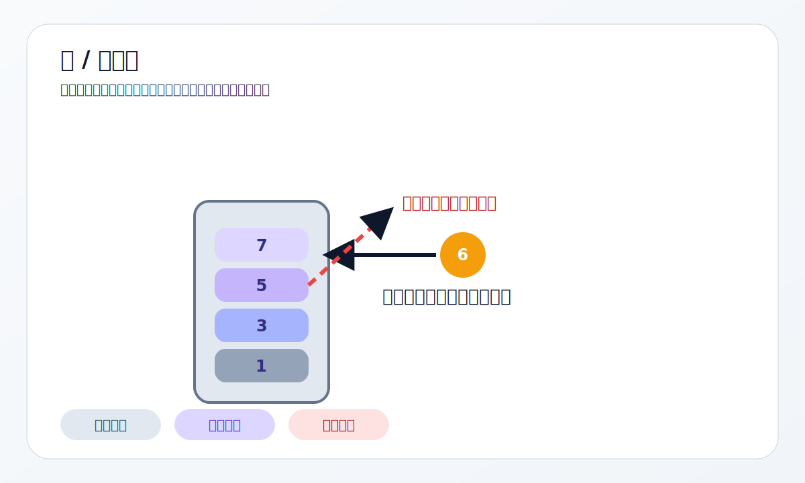

### 基本思路

普通栈解决括号、表达式、撤销型结构问题；  
单调栈解决“最近更大 / 更小”问题。

### 心理表征

单调栈像一个“候选人淘汰机制”：

- 新元素一来
- 旧元素如果不再可能有价值，就出栈
- 栈里只保留还可能有用的候选

### 基本步骤

1. 明确栈里存值还是下标
2. 新元素到来时弹出不合格元素
3. 保持单调性
4. 在弹出或遍历结束时结算答案

### 识别信号

- 左边 / 右边最近更大（小）元素
- 温度、柱状图、面积、跨度
- 括号匹配、表达式求值

---

## 9. 前缀和

**目录位置：** `src/main/java/no9_prefixsum`

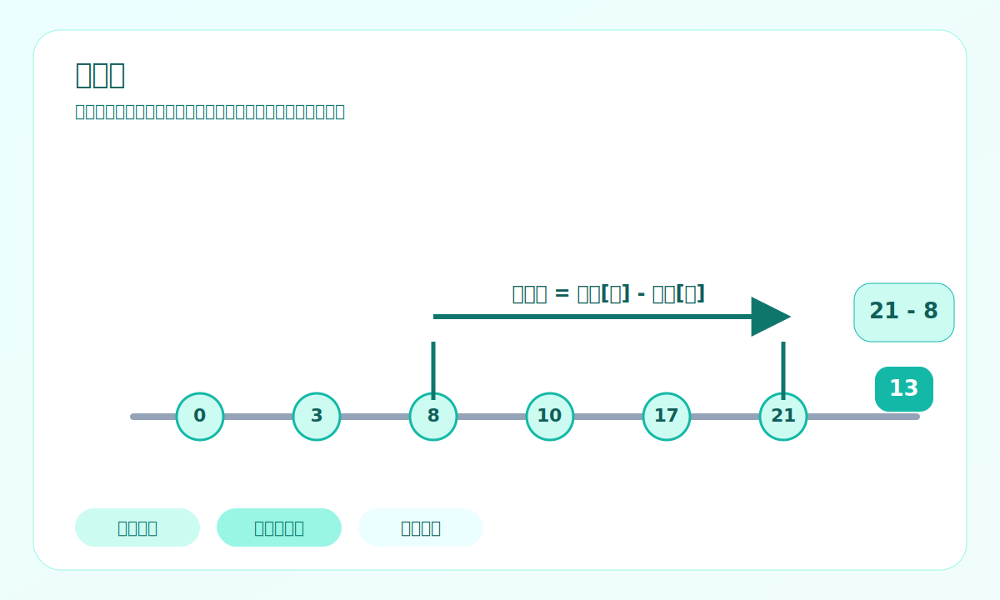

### 基本思路

前缀和用于快速求解区间累计信息。

### 心理表征

先把历史累计量都记下来，后面任何区间都能通过“两个历史量做差”得到。

### 基本步骤

1. 构建前缀和
2. 用两个前缀状态之差表达区间
3. 若要求个数，结合哈希表统计前缀出现次数

### 识别信号

- 区间和
- 子数组和为 k
- 二维区域和
- 连续区间统计

---

## 10. 并查集

**目录位置：** `src/main/java/no10_unionfind`

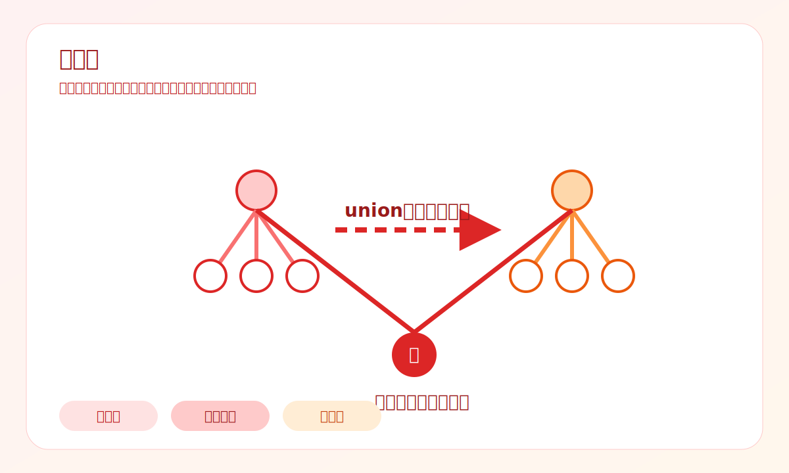

### 基本思路

并查集维护动态连通关系，特别适合“合并集合”和“判断是否同组”。

### 心理表征

把每个集合看成一棵树，树根代表这个集合。

### 基本步骤

1. 初始化父节点
2. `find` 查根
3. `union` 合并集合
4. 路径压缩和按秩合并优化

### 识别信号

- 是否连通
- 是否属于同一组
- 动态加入边
- 合并岛屿 / 合并账户 / 等式约束

---

## 11. 拓扑排序

**目录位置：** `src/main/java/no11_topologicalsort`

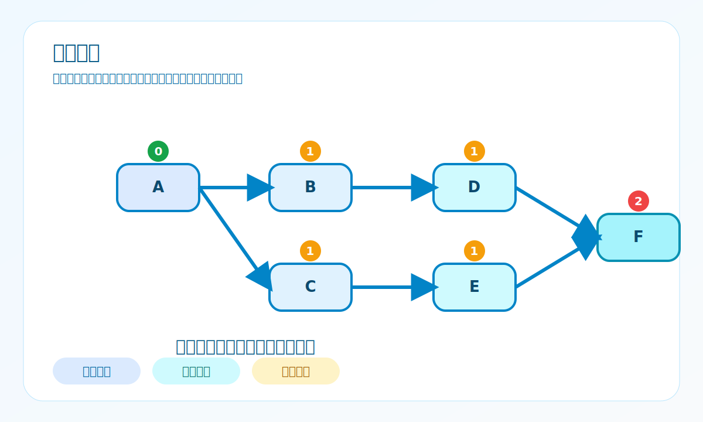

### 基本思路

拓扑排序处理有向无环图中的依赖顺序问题。

### 心理表征

不断删除“当前没有前置依赖”的点。  
删掉一层，就等于推进了一层依赖。

### 基本步骤

1. 建图
2. 统计入度
3. 入度为 0 的点入队
4. 弹出并削减后继入度
5. 判断是否处理完所有节点

### 识别信号

- 先修课程
- 任务依赖
- 是否能完成所有任务
- DAG 分层推进

你当前查看的 `src/main/java/no11_topologicalsort/practice/stage4/LeetCode_329.java` 就是一个典型例子：  
表面是矩阵题，本质可以建模成 DAG，然后用拓扑分层求最长递增路径。

---

## 一棵决策树：拿到题怎么选方法

```text
拿到题目
│
├─ 是连续子数组 / 子串吗？
│  ├─ 是
│  │  ├─ 条件能用左右边界维护？→ 滑动窗口
│  │  ├─ 需要区间和/区间统计？→ 前缀和
│  │  └─ 两端夹逼或快慢移动更自然？→ 双指针
│  └─ 否
│
├─ 问最少步数 / 最短路径 / 最少操作吗？
│  ├─ 是 → BFS
│  └─ 否
│
├─ 问所有方案 / 所有路径 / 是否存在一种方案吗？
│  ├─ 是 → DFS / 回溯
│  └─ 否
│
├─ 问最优值 / 方案数 / 可行性，且有重复子问题吗？
│  ├─ 是 → 动态规划
│  └─ 否
│
├─ 能否通过局部最优逐步得到全局最优？
│  ├─ 是 → 贪心
│  └─ 否
│
├─ 答案空间是否单调？
│  ├─ 是 → 二分搜索
│  └─ 否
│
├─ 是否在找最近更大 / 更小元素？
│  ├─ 是 → 单调栈
│  └─ 否
│
├─ 是否在维护动态连通性？
│  ├─ 是 → 并查集
│  └─ 否
│
└─ 是否存在先做 A 才能做 B 的依赖？
   ├─ 是 → 拓扑排序
   └─ 否 → 回到建模：区间？图？状态？决策树？
```

---

## 推荐训练顺序

建议按下面顺序刷：

1. 滑动窗口
2. 双指针
3. BFS
4. DFS / 回溯
5. 动态规划
6. 贪心
7. 二分搜索
8. 栈 / 单调栈
9. 前缀和
10. 并查集
11. 拓扑排序

理由：

- 前几类更容易建立“结构感”
- 动态规划和贪心更考验抽象能力
- 并查集、拓扑排序更偏图结构建模

---

## 阶段化训练建议

### 第一阶段：建立模式直觉

目标：

- 能看出题目是区间题、图题、状态题还是决策树题
- 不急着追求题量

建议：

- 每个专题先做 3~5 道基础题
- 重点写下“我为什么想到这个方法”

### 第二阶段：稳定模板输出

目标：

- 能不看题解写出标准模板
- 理解模板里的每一行为什么存在

建议：

- 每类题型至少手写 2 次模板
- 重点关注边界条件、初始化、去重、剪枝、状态定义

### 第三阶段：处理变形题

目标：

- 能把同一种方法迁移到不同载体上
- 从数组迁移到字符串、矩阵、图

建议：

- 同模式下故意做不同题面风格的题
- 做完后总结“表面不同，本质相同”的点

---

## 常见误区

### 1. 只记题，不记模式

表现：

- 题目换个说法就不会做

本质：

- 没有建立结构识别能力

### 2. 只背模板，不理解不变量

表现：

- 会写代码，但稍微变形就不会

本质：

- 不知道模板到底在维护什么

### 3. 过早做太多难题

表现：

- 一直挫败，缺少正反馈

本质：

- 模式基础还没稳定

### 4. 把所有题都往 DP 或回溯上套

表现：

- 解法对，但复杂又笨重

本质：

- 没有先寻找更贴切的结构方法

---

## 更多学习材料

- 总体学习地图：`docs/learning-map.md`
- 源码主目录：`src/main/java`
- 当前拓扑排序示例：`src/main/java/no11_topologicalsort/practice/stage4/LeetCode_329.java`

---

## 结语

刷题真正的进阶，不是“我又做出了一道题”，而是：

- 我能识别这题属于哪个结构世界
- 我知道这个模式维护什么不变量
- 我能解释为什么这个方法比暴力更高效
- 我能把这一类题迁移到新的题面中

这个仓库想做的，就是把题解堆积，升级成模式认知。

如果把每个专题都压成一句话，可以这样记：

- 滑动窗口：维护连续区间
- 双指针：维护两个位置关系
- BFS：按层扩散
- DFS / 回溯：遍历选择树
- 动态规划：记录状态答案
- 贪心：选择当前最优
- 二分搜索：找单调边界
- 单调栈：维护有序候选
- 前缀和：保存历史累计
- 并查集：维护连通块
- 拓扑排序：推进依赖顺序
